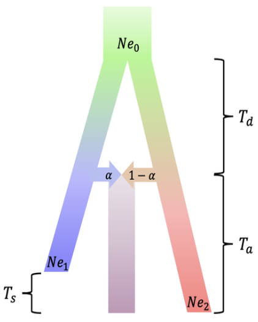

# Cadmix: probability of correct local ancestry inference (LAI) for admixed population under coalescent theory

## What is the coalescent theory?
The coalescent theory is a population model where the lineages are traced backwards from present time, by "coalescing" different lineages with their most-recent common ancestors (MRCA). Unlike the forward-time models (e.g., the Wright-Fisher model) that require keeping track of lineages that don't survive to the present-day population, the coalescent theory reduces the number of lineages as it coalesces the branches up to the MRCA of all the lineages, allowing easier modeling of population histories. 

## How do you perform local ancestry inference for an admixed population?
In our framework, we assume a population history where a single ancestral population diverges into two distinct populations (e.g., ancient human population diverging into Homo Sapiens and Neanderthals), which then admixes in a single pulse to create an admixed population (e.g., Eurasians). After some number of generations, in present day, we compare the reference segments of the genome from the two populations to compare with a segment in the admixed population to infer whether that segment came from the first or the second population. Due to mutations and recombinations, the reference segments will generally not match with the test segment completely; however, we can expect that there will be some mutations that are present in both the test segment and the (correct) reference segments, which will allow us to call its local ancestry. It is also possible that the wrong reference segment has more common mutations, in which case our inference would be incorrect. Our approach is to model this inference process using the coalescent theory: what is the probability that the test segment coalesces with the correct reference segment before the incorrect reference segment?


## Why is this important?
Unlike global ancestry that most people are familiar with (e.g., 23-and-Me), local ancestry provides a higher-resolution view into how populations interact with each other or how certain traits might have shaped the population history. There are many statistical methods that perform LAI under various assumptions, which have uncovered interesting insights into population history of diverse demographies. However it is not very clear when we can do accurate LAI -- for instance, for genomic regions with high recombination rates, can we still do proper LAI? Or, for certain demographies (which would have different sets of population parameters), what's the best LAI we can do? In this project, we investigate what is the theoretical limit of (reference-based) LAI, and look at several real demographies.

## How to run:
Cadmix can be run by building an executable with ```make```. There are many parameters that you can input (tailored to your demography of interest):
```
--branch-short-1 (-s) : branch shortening for Population 1
--branch-short-2 (-S) : branch shortening for Population 2
--out (-o) : output path to save results
--bins (-b) : number of bins to numerically integrate the length distribution of the segment
--window-size (-w) : a fixed segment length (instead of using a distribution) in base pairs.
--threads (-t) : number of threads for multi-threading
--num-ref (-n) : number of reference genomes used for comparison
--tafter (-A) : time (in number of generations) after the admixture event
--tbefore (-B) : time (in number of generations) before the admixture event (i.e., divergence time)
--alpha (-a) : admix proportion (0.0 - 1.0) of Population 1 (the rest is Population 2)
--pop-eff (-e) : effective population size of the ancestral population (Ne0)
--pop1 (p) : effective population size of Population 1 (Ne1)
--pop2 (P) : effective population size of Population 2 (Ne1)
--mut-rate (u) : mutation rate per length per generation
--rec-rate (r) : recombination rate per length per generation
--cond : calculate after conditioning the local ancestry on Population 1
--non-ind : calculate without the independence assumptions of the lineages
--mult-ref : calculate with the multiple reference approximation
--verbose : print extra information (such as length distribution, pCorrect by length, etc.)
--complete : perform a calculation over a range of parameters (over alpha, pop1, tafter, tbefore, mut-rate and rec-rate)
```

An example run (for African American admixture event) is provided in the run.sh script.
